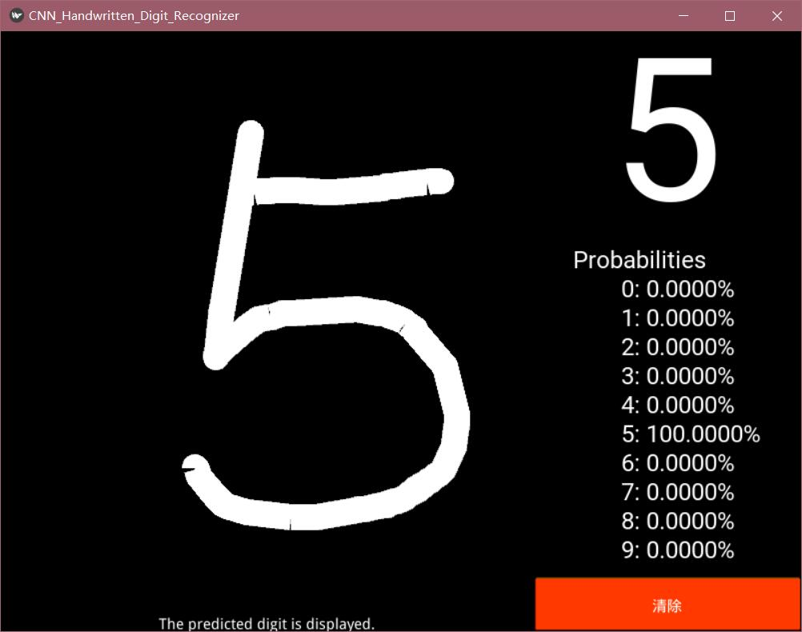

# CNN_Handwritten_Digit_Recognizer (CNN手写数字识别)
A CNN handwritten digit recognizer with graphical UI, implemented with Python (tensorflow, kivy).

一个带界面的CNN手写数字识别，使用Python（tensorflow, kivy）实现。



## Introduction (简介)

This is a simple handwritten digit recognizer application, implemented with only Python language. Basically, I use Tensorflow to build the CNN classifier as the recognizer, and use Kivy to realize the UI. This program supports mouse or touch screen, and can recognize 0-9 altogether 10 numbers. The keypoint is as follows:

- Use Tensorflow (as well as its Estimator API) to build the CNN model. Use MNIST dataset to train the model.
- Use Kivy to build the UI.
- After drawing digit on the Kivy App window, the app export the digit as a image, which, after being processed with PIL, is feeded to the CNN model. The recognition result is displayed on the window later.

这是一个简单的手写数字识别小应用，全部使用Python语言实现，主要使用Tensorflow搭建CNN分类器作为后台识别器，使用Kivy框架编写前端界面，支持鼠标或触控操作，能够识别0-9这10个数字。实现的技术要点如下：

- 使用Tensorflow（和其Estimator API）构建CNN模型，使用MNIST数据集训练模型；
- 使用Kivy框架构建前端界面；
- 在Kivy界面上写字后，将界面导出成图片，使用PIL处理后喂给后端的CNN进行识别，识别结果显示在界面上。

## Dependencies (依赖环境)

- Python 3
- Tensorflow
- Kivy
- Numpy
- PIL

## Run (运行方法)

Run the main app:

```python
python main.py
```

Train the model (trained model is included, so the main app can work immediately)

```python
python trainer.py
```

You can also modify some hyperparams in ``trainer.py``.

使用以下命令启动主程序：

```python
python main.py
```

使用一下命令进行模型的训练（已有训练好的模型，可以直接使用）：

```python
python trainer.py
```

可以在``trainer.py``文件中更改各种模型的超参数。

## Existing Problems (存在的问题)

Some existing problems, which I will try to find out the reasons and fix in the future when I'm free. There we have:

- When drawing digit at the first time after the app runs, the response time is quite long. I guess it's about the loading of tf, and multi-thread may help.
- The effectiveness of the recognition is not very good. The classifer is easy to mix some digits (like 2 & 7, 2 & 3, 0 & 6 etc.).
- If I modify the x in MNIST dataset, changing values not equal to 0 into 1, the training speed will be much slower. I don't know why.

**If you know how to handle these existing problem, or any other problems, feel free to let me know. Thank you!**

现在已知存在的问题，之后有时间再找原因修复。问题有：

- 启动程序后，第一次写字，响应速度慢，猜想是第一次要加载tf相关的东西，拖慢了速度，估计可以用多线程解决；
- 识别效果一般，有几个数字（如2和7，2和3，0和6）经常混淆；
- 若将MNIST数据集进行处理，将x中所有非0值改为1，训练速度会极大的下降，不知道是为什么。

**存在的这些问题或其他问题，若有大神知道原因或解决方法，求告知。**

## Finally (最后)

I wrote it just for fun, btw learn the use of Tensorflow and git. I'm new to TF and DL. Any seggestions is welcomed. Thank you!

这个小程序就是自己写着玩，顺便学学Tensorflow和git的使用。TF和深度学习新手，请多包涵，请多指导。

## Reference (参考资料)

- [使用tensorflow实现CNN](https://blog.csdn.net/skullFang/article/details/80434973)
- [Tensorflow-Example](https://github.com/aymericdamien/TensorFlow-Examples)
- [Tensorflow-Estimator-自定义估算器](https://www.jianshu.com/p/5495f87107e7)